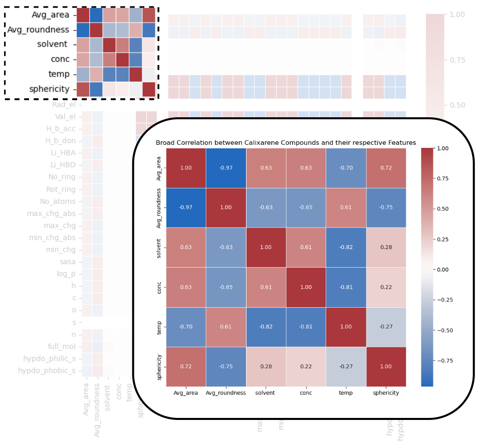
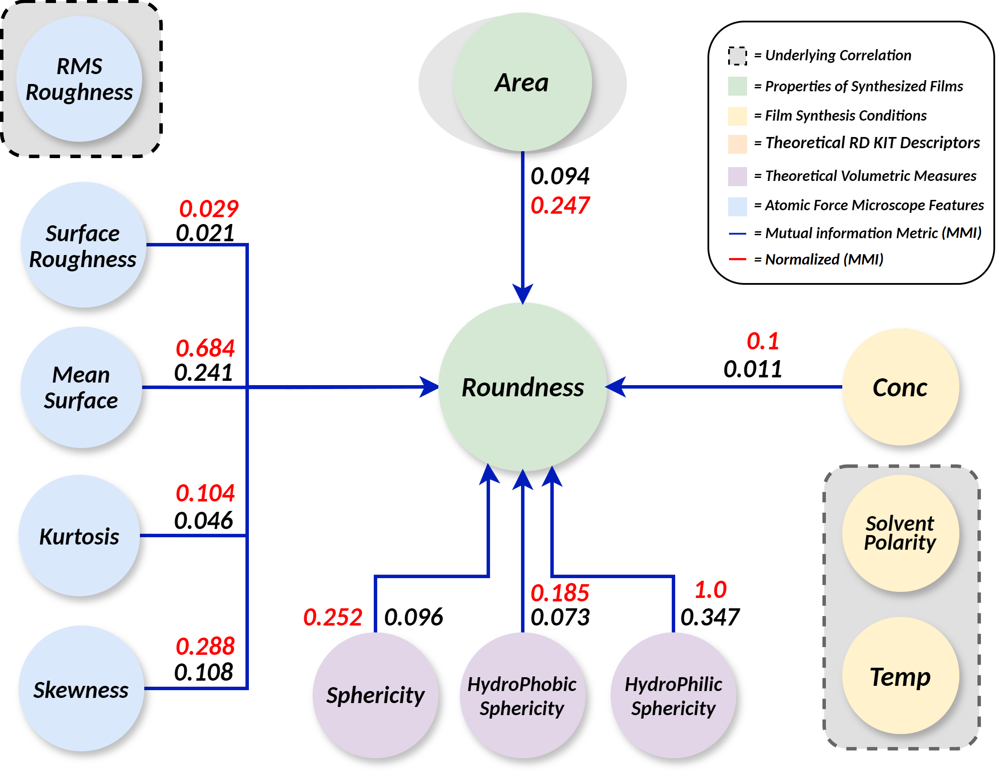

# Calixarene Aggregate Analysis

## Introduction

This repo presents the results of analysing aggregate behaviour of Calixarene group compounds (thiacalix[4]-crown-ethers) under various synthesis conditions. By varying the compound, solvent, mixture temperatures and concentration during the synthesis procedure, we acquire twelve individual films displaying different aggregate behaviour. Using a combination of machine learning, image segmentation and Data analysis, we explore the relation of synthesis conditions to the occurrence of aggregates on the surface of these films. These films with aggregates are primarily aimed at being used as drug carriers in medicine. This research aims to explore the underlying relation between the behaviour of aggregates & their properties with those of the synthesis conditions, therefore allowing theoretical prediction of aggregate properties before conducting complete chemical synthesis. Further, this repo consists of the Python code, generated results and data analysis performed on the results. 

## Data 

We acquired films composed by varying compositions of:

Calixarene Compounds: 
- C46H58O6S4 – Amphiphilic tert-butylthiacalix[4]mono-crown-4 
- C40H40N4O18S4 - Bolaamphiphilic 1,3-alternate nitrothiacalix[4]bis-crown-5 

Solvent:
- Chloroform - CHCl3 
- Toulene - C6H5CH3

Solvent Concentration: 
- 10-4
- 10-5

Compound & Solvent Temperatures:
- 4*C 
- 23*C 

Where, we extract the following data: 

1. Descriptor data of Compounds and Solvents extracted from RD-KIT toolbox [3] using SDF files 
2. Synthesis conditions indicating temperature & concentration respectively
3. Packing Factor of each compound (Hydrophilic & Hydrophobic sections) after Density functional theory (DFT) optimization
4. Metrics from Atomic Force Microscope scans extracted using Cellpose Plus [2] and Gwyddion Toolbox 
    1. Mean Particle Size - MPS (Aggergate Size)
    2. Dispersity - (Ratio of standard deviation of aggreagates to mean particle size)
    3. Ratio of area covered by Spheres to the substrate 

Generation of Atomic Force Microscopy metric 4.i, 4.ii, 4.iii were conducted as follows:

Figure [2]: The image above shows an AFM scan of one of the sample films and their segmentation of aggregate-substrate areas. Using the data extracted from cellpose plus and gwyddion, we process the data to be used in our analysis. 

## Methodology

An overview of our experimental pipleline of aggregate analysis. The figure highlights the use of chemical descriptors along with atomic force microscopy features of synthesized films to analyse correlations and dependenceis within the synthesis procedure. 

A Pipeline of aggregate analysis using regression models (Random Forest and Linear Regression) on data acquired from image segmentation from Cellpose Plus [2], Atomic force microscopy data and Chemical Descriptors from RD-KIT toolbox [3]. 

## Results 
 
 To investigate aggregate behaviour we explore two approaches on obtained data. 

1. Correlation an Depedency Analysis: We performed a combined correlation analysis on data obtained from theoretical data, practical observations from AFM scans and aggreagate features of various compositions. Figure [2] provides an overview of our approach to performing corelation analysis. Figure 3 shows the Co-relation plot of all descriptors related against each other.
We observed the roundness of aggregates had a positive trend with temperature while the area of the aggregates reduced over increasing temperature (i.e. Cold 4*C to warm 23*C). The temperature of solvent was observed to have a mildly negative correlation with sphericity and a moderate negative correlation with AFM surface features giveing a smoother surface We also observe the Sphericity and the concentration of solvents to have a negative trend with the Roundness of the artefacts. Further, on analysing mutual dependency of data, we revealed a underlying corelation between Sphericity of Aggregates, concentration of compounds during synthesis and area covered by aggregates. Next, we proceed with prediction of Aggregate behaviour using Machine learning regression algorithms. 

Correlation graph showcasing the relation between metrics and synthesis data

Mutual Information Graph showing underlying dependency between metrics and data

2. Machine Learning via Regression: Using Atomic Force Microscopy (AFM) data, the extracted descriptive metrics of the aggregates i.e. mean particle size (MPS), Polydispersity (PD), ratio of area covered by sphere to substance (RAS) and the theoretical descriptors generated from RD-KIT toolkit, we use them to train the regression models to estimate and classify films as per their aggregate behaviour. These results extends prior analysis performed via correlation analysis and mutual information to provide ground work for analysis of a larger sample sets of data and create models to predict surface properties, given the prior theoretical synthesis conditions. 

We perform Linear and Random forest regression using data in three perspective cases to ensure complete coverage and covering for chance occurences i.e. regression using: 
1. Exclusively Theoretical Descriptors (from RD-Kit)
2. Exclusively Synthesis conditions
3. Both Theoretical descriptors & Synthesis Conditions

From the regression results, we observed: 
- RD Kit descriptors had best r2 score of 0.63 when predicting the mean particle size 
- Dispersity was best predicted using (Synthesis conditions & RD Kit Descriptors) with best r2 score of 0.3
- Yet, for Ration of spheres to substance the observed results were rather weak for given twelve samples with an average R2 score of 0.2 across all three data types. 

## Code 

The Repo consists of Python Code in Notebooks to show existing experiments
1. T-Test to Extract Descriptors with P-Value greater than 0.05
2. Linear Regression 
3. Random Forest Regresion 

## Scientific Article (in-progress)
 We are currently preparing a full-fledged version of our experiment using a larger dataset aimed at publicaiton in scientific journals. [1] is the most recently published work, showing the intial experiment highlighting groundwork and achieved progress on this experiment.

## References

[1]: Chetinel, I. D., et al. "Control of Self-Organization of Thiacalix [4] Crown-Ethers in Cone and 1, 3-Alternate Forms in Nanofilms on Quartz Substrate." Colloid Journal 87.2 (2025): 236-245.

[2]: Huaman, Israel A., et al. "Cellpose+, a morphological analysis tool for feature extraction of stained cell images." arXiv preprint arXiv:2410.18738 (2024).

[3]: Landrum, Greg. "Rdkit documentation." Release 1.1-79 (2013): 4.
