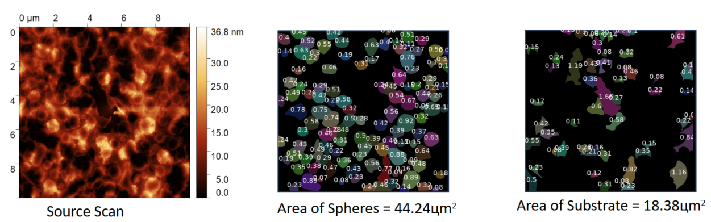

# Calixarene Aggregate Analysis

## Introduction

This repo presents the results of analysing aggregate behaviour of Calixarene group compounds (thiacalix[4]-crown-ethers) under various synthesis conditions. By varying the compound, solvent, mixture temperatures and concentration during the synthesis procedure, we acquire twelve individual films displaying different aggregate behaviour. Using a combination of machine learning, image segmentation and Data analysis, we explore the relation of synthesis conditions to the occurrence of aggregates on the surface of these films. These films with aggregates are primarily aimed at being used as drug carriers in medicine. This research aims to explore the underlying relation between the behaviour of aggregates & their properties with those of the synthesis conditions, therefore allowing theoretical prediction of aggregate properties before conducting complete chemical synthesis. Further, this repo consists of the Python code, generated results and data analysis performed on the results. 

## Data 

We acquired films composed by varying compositions of:

Calixarene Compounds: 
- C46H58O6S4 – Amphiphilic tert-butylthiacalix[4]mono-crown-4 
- C40H40N4O18S4 - Bolaamphiphilic 1,3-alternate nitrothiacalix[4]bis-crown-5 

Solvent:
- Chloroform - CHCl3 - Choloform
- Toulene - C6H5CH3

Solvent Concentration: 
- 10-4
- 10-5

Compound & Solvent Temperatures:
- 4*C 
- 23*C 

Where, we extract the following data: 

1. Descriptor data of Compounds and Solvents extracted from RD-KIT toolbox [3] using SDF files 
2. Synthesis conditions indicating temperature & concentration respectively
3. Packing Factor of each compound (Hydrophilic & Hydrophobic sections) after Density functional theory (DFT) optimization
4. Metrics from Atomic Force Microscope scans extracted using Cellpose Plus [2] and Gwyddion Toolbox 
    1. Mean Particle Size - MPS (Aggergate Size)
    2. Dispersity - (Ratio of standard deviation of aggreagates to mean particle size)
    3. Ratio of area covered by Spheres to the substrate 

Generation of Atomic Force Microscopy metric 4.i, 4.ii, 4.iii were conducted as follows:

The image above shows an AFM scan of one of the sample films and their segmentation of aggregate-substrate areas. Using the data extracted from cellpose plus and gwyddion, we process the data to be used in our analysis. 

## Methodology

An overview of our experimental pipleline of aggregate analysis. The figure highlights the use of chemical descriptors along with atomic force microscopy features of synthesized films to analyse correlations and dependenceis within the synthesis procedure. 

A Pipeline of aggregate analysis using regression models (Random Forest and Linear Regression) on data acquired from image segmentation from Cellpose Plus [2], Atomic force microscopy data and Chemical Descriptors from RD-KIT toolbox [3]. 

## Results 

...

## Code 

...

## Scientific Article (in-progress)
 We are currently preparing a full-fledged version of our experiment using a larger dataset aimed at publicaiton in scientific journals. [1] is the most recently published work, showing the intial experiment highlighting groundwork and achieved progress on this experiment.

## References

[1]: Chetinel, I. D., et al. "Control of Self-Organization of Thiacalix [4] Crown-Ethers in Cone and 1, 3-Alternate Forms in Nanofilms on Quartz Substrate." Colloid Journal 87.2 (2025): 236-245.

[2]: Huaman, Israel A., et al. "Cellpose+, a morphological analysis tool for feature extraction of stained cell images." arXiv preprint arXiv:2410.18738 (2024).

[3]: Landrum, Greg. "Rdkit documentation." Release 1.1-79 (2013): 4.
